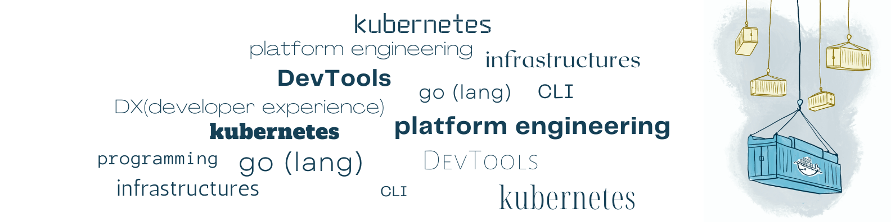

## 🚀 Hi, I'm Zdenko Vrabel, a Developer from Slovakia.

I'm ordinary engineer who is constantly jumping between **code** and **infrastructures**. I like to be in both boots - SWE and SRE. But what I like most? It's building small CLI tools for other engineers. Most of my life I spent as programmer - with touching the code. But also I was always very close to infrastructures. After years of **C/C++** and **Java** I jumped into **Go** lang bandwagon. And I'm more than happy with this language.

I have passion for **container internals**, for runtime, for distribution and networking of containers. In my spare time, I'm **blogging** on (https://okontajneroch.sk) and speaking about containers on meetups for our local tech community in Kosice. Also I'm posting technical content on LinkedIn, and trying to make LI more interesting place for tech people.

I'm big believer in **platform as a product** idea as next step in DevOps evolution. I believe we need more product thinking in infrastructure platform domain. This leads me to self-study of a product design. Yes, I'm big fan of Marty Cagan. CLI tools are awesome products :)

I'm also **open to new opportunities** in container world. I would like to uplift my passion for container internals from hobby to full-time job. Not to be just regular user (SRE or DevOps eng.) of containers but also participate on creation. I'm not looking for generic DevOps position same as I'm not looking for Java position.

My CV is available [here]()

&nbsp;&nbsp;

  
  
  &nbsp;&nbsp;
  

